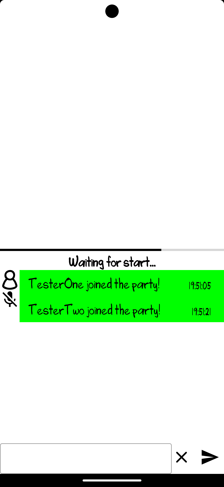
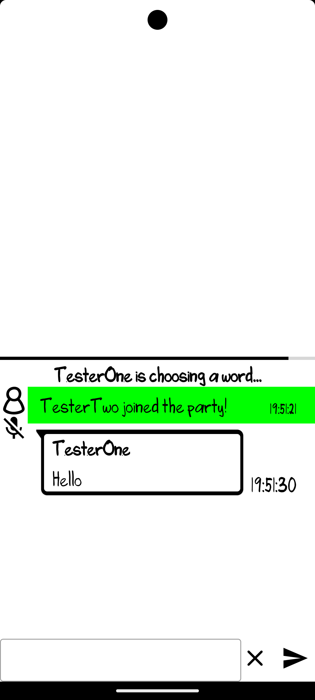
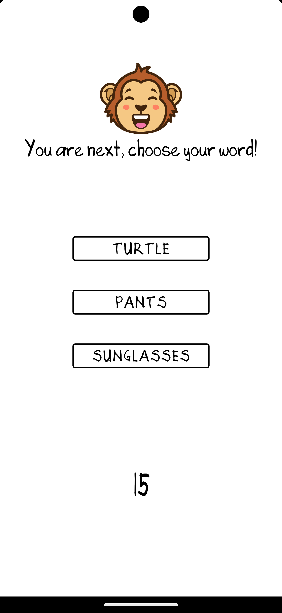
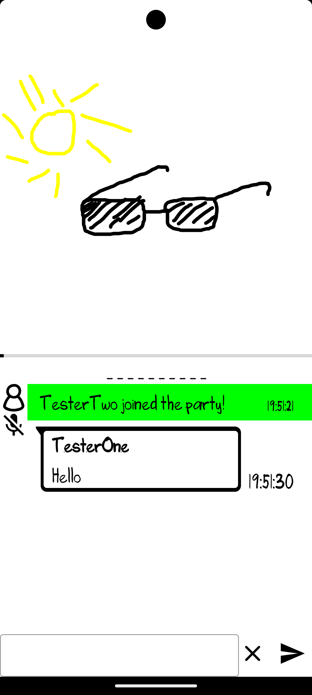
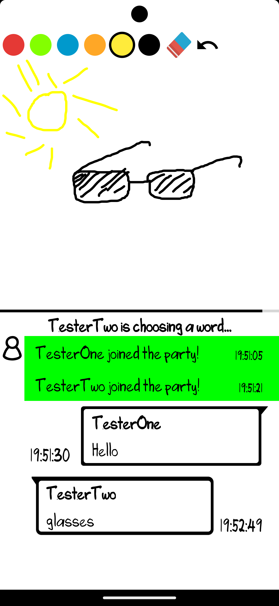
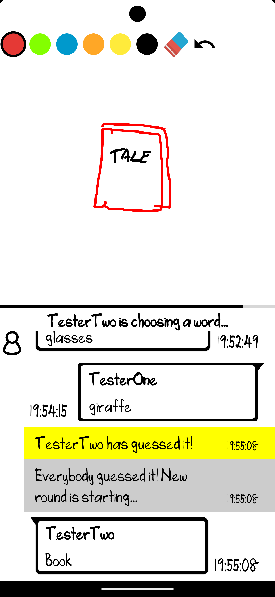

# ktor-scribblefrenzy
Disclaimer: This project was purely developed for learning purposes.

## Overview
**DoodleKong** is an online scribble game, in which players have to guess what another player has drawn and get rewarded with points if they guessed correctly.

To use this app you need to run the following server, which was specifically build for this app: https://github.com/landmuc/ktor-scribblefrenzy

## Features

- **Kotlin**
- **Custom Views**
- **Kotlin Coroutines**
- **Websocket handling with Scarlet**
- **RetroFit**
- **DataStore**
- **Dagger Hilt**
- **Real time communication**

## Screenshots

    

    

